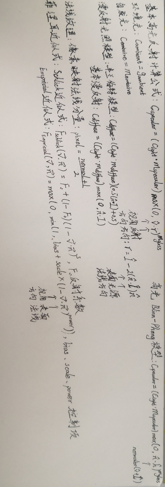

# Notes

## Untitled

### 其他

- '/'forward slash在网络上使用，'\'backward slash在window文件系统和转义使用
- URL保留字符：space=%20
- redis与monogo配合mysql实现冷热数据存储
- 多层状态机中，上层状态机为下层状态机设置目标实现控制
- mvc和esc设计的类同和区别，避免在游戏开发使用mvc
- 欧拉角存在万向结死锁的情况，由于其旋转定义为先z、再x、再y的顺规定义，在某些情况存在某轴向自由度丢失的情况
- 四元素是一种人为定义的数学工具，让相对坐标轴的平滑的旋转移动可以通过一个数值的变化表现出来，摆脱以往需要多个数值变化的繁杂
- jps寻路，A*的改进算法，根据强迫邻居、jump point来确定路径，跳跃查找减少运算量
- smb共享：专用防火墙关闭，固定ip，开启网络发现，密码保护共享，smb文件共享功能，完成后重启
- 混合編程（Lua & C#）：程序操作數據/内存，不同语言是不同操作模式的表达方式，不同语言是不同的手套，手套套手套是经常使用的方式，在程序中不同语言在程序里面转移控制权
- 異步常用回調函數

---

### 插件

1. [Unity-Logs-Viewer](https://github.com/aliessmael/Unity-Logs-Viewer)
2. SimpleJson
3. rapidJson解析器
4. flutter_unity_widget[android打包](https://juejin.cn/post/7021063008143015950)
5. [paq8压缩](https://github.com/hxim/paq8px)
6. Unity Amplify Shader

### 注释说明

1. TODO：如果代码中有该标识，说明在标识处有功能代码待编写，待实现的功能在说明中会简略说明。
2. FIXME：如果代码中有该标识，说明标识处代码需要修正，甚至代码是错误的，不能工作，需要修复，如何修正会在说明中简略说明。
3. XXX：如果代码中有该标识，说明标识处代码虽然实现了功能，但是实现的方法有待商榷，希望将来能改进，要改进的地方会在说明中简略说明。
4. HACK：如果代码中有该标识，说明标识处代码需要根据自己的需求去调整程序代码。

### 代码规范

- bool类型以is、has、can开头
- 接口以I开头
- 以基类作为派生类结尾
- 泛型类型以T开头
- 枚举类型使用单数
- 谓词命名方法和事件，不使用Before、After区分事件前后
- 属性和字段使用Pascalcase
- 参数和局部变量使用驼峰
- 私有以'_'开头+驼峰
- 变量名以@开头，使用关键词作为名称
- 特性以Attribute结尾
- 文件地址相关全lowercase
- 非公开方法可以以Internal、Implement开头
- 异步以Async结尾
- 单词不能产生歧义  
  Order用于排序，不用于命令  
  Apply用于应用，不用于申请  
  Command用于名词，不用于动词
- 尽量不使用单复数不符合常见形式的（适当的违背语法）
- toc == to client / tos == to server 为分发事件名称
- 事件内容参数 - AlarmEventArgs  
  事件 - Alarm(动词,例如KeyPress)  
  触发事件的方法 - void OnAlarm()

---

### 格式規範

- Utility 工具类目录
- Common 公用类目录
- 尽量不要在根目录创建目录，就算创建也最好有清晰的命名

---

### 部分报错处理

1. 使用protobuf-net or protobuf
   - [官方实现版本过高，需要注意unity版本](https://www.cnblogs.com/caiger-blog/p/14040130.html)
2. pip不是命令
   - pip未注册环境变量
   - [pip安装第三方报错](https://www.cnblogs.com/yinhaiping/p/13375375.html)
    > 添加--trusted-host有效: -i http://pypi.tuna.tsinghua.edu.cn/simple/ --trusted-host pypi.tuna.tsinghua.edu.cn
3. 缺少XLua项
   - 删掉Gen文件夹重新生成
4. Component GUI Layer in Main Camera is no longer available.
   - remove Component Flare Layer in Camera
5. `<a id="unitylinker"></a>`'could not produce class with id XXX', can find class id in [https://docs.unity3d.com/Manual/ClassIDReference.html](https://docs.unity3d.com/Manual/ClassIDReference.html), add link.xml in Assets document and fill in following information: `<assembly fullname="UnityEngine"> <type fullname="UnityEngine.SphereCollider" preserve="all"/> </assembly>`
6. attempt to index a boolean value：lua模块语句缺少return关键词
7. Android打包libmain.os不能加载，Configuration的il2cpp模式缺少ARM64平台作为目标

### 面向对象提示

1. 使用事件来进行跨模块的传递，不需要引用数据实例
2. 函数的参数合法性检测：一般只在用户的输入正确性，测试阶段调试或设计兼容性高的函数时需要检测合法性
3. 委托是一个类型，将具体实现交付出去；回调是函数指针，将执行时机交付出去
4. 整数ID比指针更容易指代无效的对象
5. 闭包可以从类变量与类函数来作用域来理解，函数的闭包如同类中的函数调用类的变量（自由变量）。在当前作用域之外将自由变量的状态保存下来，保持对词法作用域的引用；它形成了一个自洽的体系，有自己内部的常量表，上值表，变量表。
6. 类是引用传递，结构体默认是值传递；类可以有虚方法也可以继承其他类，结构体没有虚方法也不能继承
7. 在仅仅使用方法时静态工具类取代单例，单例只在需要面向对象特性时使用
8. 基于IEnumerable来隐藏替换List、Array等可迭代元素
9. enum 和 interface 搭配使用
10. 私有接口函数：处理接口函数之间重用部分而不在实现类实现，实现类不可访问
11. 避免使用foreach，因为会释放内存

### Lua

1. lua调用CS脚本的绑定函数（事件实现），将对应函数绑定在cs脚本（生命周期）上，实现lua的逻辑
2. lua脚本跑在lua虚拟机上，lua虚拟机整合到动态库供Unity调用，然后在C#中启动lua虚拟机，此外动态库提供一些支持代码用以Lua和Unity交互，这就是xlua、tolua的工作。
3. 虚拟机加载lua脚本：LuaEnv.AddLoader(CustomLoaderMethod)，CustomLoaderMethod为自定义脚本加载方式、返回byte[]
4. lua设置元表，不能使lua寻找父类的方法或属性，需要设置原方法：self.__index = self。因table的查找逻辑是先判断是否有元表再判断元表的__index方法，不会直接查找元表。当在当前table找不到属性的时候会一直回溯到元表table声明时就存在的属性，这些属性在面向对象中会像静态变量一样存在。__index是方法，self.__index = self 是将方法导向表。
5. 并不是说lua的继承不改变原值，而是如果要改变原值的话应该加上self.__newindex = self,这个方法也是为此而用的
6. VSCode + EmmyLua + XLua 调试，配置.vscode/launch.json

   ```json
   "configurations": [
        {
            "type": "emmylua_attach",
            "request": "attach",
            "name": "通过进程ID附加",
            "pid": 0
        }
    ]
   ```

7. pairs ipairs区别在于pairs根据next，ipairs根据 pair(1,[t]) pair(2,[t])遍历
8. lua没有提供拷贝函数，需要自行实现；浅拷贝不能复制table中的table，深拷贝特殊化table和setmatetable
9.  __index访问表不存在的值（get），__newindex对表不存在的值赋值（set）；newindex会控制对表的赋值，将新值导向newindex字段

### C\#

1. Event：不可赋值（=）委托；Action：有参无返回委托；Func：有参有返回委托
2. C#通用委托EvenArgs、EventHandler构建事件管理中心：CustomEventArgs.cs(继承EventArgs)/EventManager.cs/EventName.cs/EventTriggerExt.cs。也可以用泛型匹配方法的参数，不用EventArgs创建参数包装类。
3. C#扩展方法
   - 必须在非泛型的靜態類中聲明，且是静态方法
   - 扩展方法必须有一个参数，且只有第一个参数使用this标记
   - 靜態類本身必须具有文件作用域
   - 编译要求导入扩展方法
   - 调用时无需传递第一个参数，默认调用this作为第一个参数
   - 是不是每个对象都加入了这个扩展方法？这个问题其实并未发生，因为C#使用的方式不是给每个对象加一个方法，而是另外提供了一个扩展方法的列表，在使用时通过列表找到被扩展的静态方法然后调用，也就是说方法还是只有那一个方法，并没有大范围的占据方法区。
4. Enum做为字典的key的时候，会有装箱的行为，因为Enum没有实现IEquatable,这是字典的key必要的接口。
5. ArrayList不是类型安全的，List时类型安全，而且使用时会有拆箱装箱（把堆栈上的值类型移动到堆上，被称为装箱）操作，连着对比array优点在于动态长度
6. async/await：await不会开启新的线程；异步调用前的线程会在异步等待时放回线程池，异步等待结束后，会从线程池取一个空闲的线程，来运行异步等待调用结束后的后续代码。
7. Invoke，BeginInvoke区别：Invoke会阻塞当前线程，begininvoke则可以异步调用，不会等委托方法执行结束；invoke（同步）和begininvoke（异步）的概念，其实它们所说的意思是相对于子线程而言的，其实对于控件的调用总是由主线程来执行的。
8. 使用Mathf.PI时注意有效输入范围和结果精度（角度*PI/180 = 弧度）
9. 利用static作为全体类实体的存储库
10. const: 是静态的、编译期变量，只在聲明时赋值
   readonly: 运行时变量，在聲明/构造时赋值
   static readonly: 静态的、编译期时变量，只在静态构造时赋值
11. lock()应该锁定引用类型，推荐锁定私用的只读静态对象：private static readonly obj = new obj();
12. [optional]属性使方法参数可选：void func([optional] int num)
13. 字符串比较一般情况下，建议调用不依赖于默认设置的方法，因为这会明确代码的意图。这进而使代码更具可读性且更易于调试和维护。StringComparison.CurrentCulture/InvariantCulture/Ordinal。[https://blog.csdn.net/dark_tone/article/details/101808816](https://blog.csdn.net/dark_tone/article/details/101808816)
14. 适当使用弃元"_"减少内存的分配，例：swicth、out、元组、函数无用返回值
15. 使用partial将类分到不同的地方实现，逻辑清晰些；例：扩展方法、引用外部扩展
16. DllImport("Dll Name")其功能是提供从非托管DLL导出的函数的必要调用信息。会按照顺序自动去寻找的地方
    - exe所在目录
    - System32目录
    - 环境变量目录
17. [MonoPInvokeCallbackAttribute()]，此属性在静态函数上有效，Mono 的提前编译器使用它来生成支持回调用托管代码的本机调用所需的代码。
18. DllImport & MonoPInvokeCallbackAttribute 配合使用，
19. 字符'$'作用：代替string.format()；格式：$"string{}"
20. 字符'@'作用：原意标识符，即除了("")不会按字面解释，简单转义、Unicode转义序列都将按字面解释；格式：@"string"
21. .Net.Sockets命名空间
    1. NetFrameWork为Socket通讯提供System.Net.Socket命名空间
    2. .Net.Sockets命名空间重要的类
       - Socket：用于管理链接，WebRequest/TcpClient/UdpClient在内部使用这个类
       - NetworkStream：从Stream派生，接收来自网络的数据流
       - TcpClient：允许创建并使用Tcp链接
       - TcpListener：允许监听传入的Tcp链接请求
       - UdpClient：用于客户端创建UDP链接
    3. Socket/TcpClient异步通信:BeginConnect(); EndConnect();
       - BeginConnet方法在操作完成前不会组设，使用该方法时系统会动用独立的线程来执行，直到链接成功或抛出异常；EndConnet是一种阻塞的方法，用于完成BeginConnect方法的异步链接到远程主机的请求。异步BeginConnet只有在调用了EndConnet方法后才算执行完成，程序需要在提供给requestCallback委托调用的方法中调用TcpClient对象的EndConnet方法
22. System.Reactive.Subjects.Subject 实现观察订阅模式
23. final 在 J# 中已经弃用但有可能会在面试中提到
24. sealed 关键字用于类时，该类被称为密封类，密封类不能被继承；用于方法时，该方法被称为密封方法，密封方法会重写基类中的方法；sealed修饰符应用于方法或属性时，必须始终与override一起使用；结构是隐式密封的，因此它们不能被继承
25. Dictionary字典使用引用类型做key时需要注意，string是不可变的引用类型

### Unity

1. 关于代码剥离的构建：Unity会使用一个专门用于托管代码剥离的工具UnityLinker来进行剥离处理,其默认将unity中用到的所有程序集合并程一个整体程序集，然后根据一定规则，比如场景中游戏对象继承Monobehavior的对象，标记根元素，再次有根元素进行依赖查询，并将其他依赖的程序集或类或命名空间进行打标记。最后没有被标记的，将会被裁剪剥离。UnityLinker在构建时，会检查Assets/link.xml文件[sample](#unitylinker)，将里面设置的忽略的程序集或者类型直接标记为根元素。或者我们可以为需要保留的程序集、类和方法加上[Preserve]特性，针对性的解决错误代码剥离。[https://blog.csdn.net/zhush_2005/article/details/125229154](https://blog.csdn.net/zhush_2005/article/details/125229154)
2. 利用config中prefab实例化（关于config的使用）
3. 将存储实现ISavable依赖于SavingEntity调用，避开存在ISavable实现的多处地方调用形成相同的副本
4. AppInfoBack是安卓和iOS写死的回调方式
5. 外部调用通过: void SendMessage(string methodName, object value = null, SendMessageOptions options = SendMessageOption.RequireReceiver);
6. UnityWebRequest和HttpWebRequest系列都可以用来进行通信，功能上是一样的
7. [插件默认下载位置](C:\Users\Administrator\AppData\Roaming\Unity)
8. 聲明 [DllImport("__Internal")]表示这个函数位于DLL中，DLL名字是 __Internal，这是固定语法，意思是这个函数是静态链接在 iOS 的 App 中的
9. [MonoPInvokeCallback()]，用来标记这个函数会被iOS反向调用<https://www.jianshu.com/p/f01c7e3f666c>
10. Burst Compiler的代码优化过程主要包括以下几个步骤：
    1. 将C#代码编译为中间语言IL代码。
    2. 将IL代码转换为C++代码。
    3. 使用C++编译器将C++代码编译为本地代码。
    4. 使用Burst Compiler的代码生成器生成多个版本的本地代码。
    5. 使用SIMD指令和多线程技术来优化代码的性能。
    6. 使用缓存优化技术来优化代码的性能。
11. Burst就是LLVM将C#代码转换成LLVM IR中间代码，通过LLVM的优化和代码生成功能生成目标平台的Native机器码。这个过程中，Burst利用了LLVM中内置的向量化指令优化技术，将一些常规的循环和算法转换成SIMD指令集，以实现对代码的高效优化。但Burst只支持值类型的数据编译，不支持引用类型数据编译。<https://zhuanlan.zhihu.com/p/623274986>
12. 多线程方式：TPL（task）、job system，TPL是.Net 5后基于ThreadPool设计的一组api，job system是unity提供配合brust使用的多线程解决方案
13. async 用在方法定义前面，await只能写在带有async标记的方法中；注意await异步等待的地方，await后面的代码和前面的代码执行的线程可能不一样；async关键字创建了一个状态机，类似yield return 语句；await会解除当前线程的阻塞，完成其他任务；处理本地IO和网络IO任务是尽量使用async/await来提高任务执行效率
14. sprite editor 的Custom Outline减少渲染大小，Custom physics初始化碰撞形状
15. EventTrigger继承了许多接口，接收来自 EventSystem 的事件，并为每个事件调用已注册的函数；（注意）将此组件附加到游戏对象将导致该对象拦截所有事件，并且所有事件都不会传播到父对象。
16. 点乘(dot)求角度，实际应用中可以判断当前方向与目标之间的角度，例如计算角色朝向和目标方向夹角，判断角色左转还是右转
17. Unity使用的矩阵通常为4*4矩阵，用以描述向量平移、旋转、缩放等所有线性变换，为了简化用户编程接口，Unity将矩阵运算融合到了常用Vector3和Quaternion类中
18. 引入齐次坐标的主要目的
    1. 为了更好的区分向量和点，（x，y，z，1）标识坐标点，（x，y，z，0）表示向量
    2. 可以标识平移变换
    3. 当分量w=0时可以表示无穷远的点
19. 三种表示方式区别

      | \ |欧拉角|矩阵|四元数|
      |:---:|:---:|:---:|:---:|
      |旋转一个位置点  |不支持    |支持       |不支持|
      |增量旋转       |不支持    |支持，速度慢|支持，速度快|
      |平滑插值       |支持      |基本不支持  |支持|
      |内存占用       |3个数值    |16个数值   |4个数值|
      |表达是否唯一   |无数种组合 |位移       |互为负的两种|
      |可能会遇到的问题|万向锁    |矩阵蠕变   |误差累计导致非法|

20. Transform组件的Rotation属性返回的就是一个四元数，但不能直接对Quaternion.rotation赋值，而是使用Quaternion.euler（vector3 v）：
transform.rotation = Quaternion.Euler(new vector3 (0,90,0));
21. 一个场景只能有一个AudioListener
22. 在运行时基于相同的AnimatorController交换 Animator.runtimeAnimatorController 和 AnimatorOverrideController，重写某个控制器的AnimationClip
23. 帧同步<https://blog.csdn.net/wanzi215/article/details/82053036>

#### 性能优化

1. 如何做好Unity项目性能优化的?
出这个面试题,目的就是看你是否从系统上去思考如何把控游戏项目的性能。定位到了是某方面的问题，再去应对一些常用的手段，这里把一些常用的列举一下
    - Drawcall优化: 确定是Drawcall问题后，根据游戏项目选择一种合适的合批技术，为这个技术创建可合批的条件，做好合批,具体可以参考我写的《Drawcall优化系列》教程详细的分析了Drawcall合批的技术手段与原理，性能与开销(what?合批还有开销？没有错)。
    - 渲染优化: 看下pass的次数与set pass 次数, pass 次数，比如阴影这些都会导致多次pass,多光源这些会导致多次pass, 我们可以通过定制渲染管线,优化shader代码, 优化光照计算等，从Shader+渲染管线级别来做好渲染优化，现在比较火的UPR渲染，也可以参考我写的《URP 实战系列》的教程。还有LOD优化，远处用的面数少，近处用的面数多。抗锯齿算法优化等。
    - 物理引擎优化: 这块化没有太多的空间了，用其它的技术去替代不用物理引擎，减少物理引擎的迭代参数,减少计算量，减少物理刚体的数目。
    - 网络优化: 异步IO代替同步IO，多线程处理网络消息, protobuf序列化与反序列化优化网络包体体积。KCP 替换传统的TCP。
    - 包体优化: 优化图片，声音体积，通过改变压缩参数来降低这些资源的体积大小。可以使用服务器上部署资源包来实现打空包机制进一步减少包体体积。
    - 热更新优化：版本管理，增量下载，断点续传等。
    - 内存优化: 减少资源的内存占用，不用的资源卸载掉，吃入显存的纹理可以采用平台支持的压缩格式。缓存池,减少内存碎片,减少对象的反复构建，避免GC峰值冲击等。具体可以看下《性能优化-内存篇》。
    - 模型优化：通过细节增强,法线贴图，高度贴图，凹凸纹理等减少模型面试的同时获得很好的效果。
    - 寻路导航优化: 优化算法，流场寻路等，多线程优化寻路算法。
    - 代码写法优化: for循环内部不要过多跳转打乱CPU Cache等。……
2. 性能问题定位和分析
    - 代码算法与系统底层功底: 为什么大厂老要求算法，OS底层，数据结构，引擎底层,只有对这些基本的原理原则了解了，思考问题的时候才知道如何分析与解决。比如算法的时间复杂度，空间复杂度，比如Drawcall合批所带来的性能提升与性能开销的权衡等。
    - 工程管理手段: 通过工程手段测试出来了性能问题，我们可以比对上一次测试与本次测试的开发记录，看看是引入与编写了哪些代码导致的性能问题，屏蔽掉可疑的代码,反复确定,这样能帮助我们瞬间就定位到出现的性能问题。(注：95%以上的问题我都是通过这种对比发现的，通过开发记录对比可疑代码，屏蔽可以代码确认，从而分析问题最后解决)
    - 打印: 没有打印解决不了的问题，如果有继续打印，linux 内核的开发与调试基本就靠打印，因为复杂的多线程调度环境，任何工具都不好定位，所以没有打印解决不了的问题。
    - 性能工具剖析手段: 通过Unity提供的性能剖析工具,来进行问题定位与分析。Unity引擎运行中会提供很多API与性能参数给用户获取，而Unity引擎自带的工具也是调用这些API获取游戏的性能,比如stats统计与Profiler统计。同时还有一些第三方的插件，也是做性能监视的，本质也是读取Unity引擎提供的性能参数API，把自带工具没有显示出来的重要性能参数显示出来给用户。注:不要迷恋工具，要从管理+数据+执行流程上对程序进行分析，性能工具是做这些分析的方法之一，甚至不是最重要的
3. <https://blog.csdn.net/f402455894/article/details/120309344><https://developer.unity.cn/projects/60e2a5f9edbc2a04cfc5e341>
   1. 资源内存
      - 正确导入纹理
      - 使用LOD
      - 遮挡剔除（Window - Rendering - Occlusion）/ 设置静态对象
   2. 图形和GPU
      - 批处理
      - 减少动态灯光
      - 禁用阴影
      - 将光照烘培到光照贴图
      - 光照探针
      - 限制摄像机
   3. 代码框架
      - 减少Update代码
      - 不在Update创建对象
      - 一次创建多次使用：在Awake和Start分配所有内容
      - 避免空事件：删除空的Update/FixedUpdate
      - 使用哈希而不是字符串参数，字符串方法只执行字符哈希处理
      - 在C#中，字符串属于引用类型，而非值类型。减少不必要的字符串创建或更改操作，尽量避免解析JSON和XML等由字符串组成的数据文件，将数据存储于ScriptableObjects，或以MessagePack或Protobuf等格式保存。在运行时构建字符串，可使用StringBuilder类
      - 尽可能不适应LINQ
      - 注意装箱
      - 仅在需要时运行代码：使用C#事件实现观察者设计模式
      - 使用Array列表代替List数组
      - LocalPosition代替Position
      - 缓存Camera.main，避免直接调用
      - 注意协程
      - 避免运行时添加组件
      - 使用ScriptObject
      - 使用对象池
      - 使用NonAlloc函数，碰撞检测函数常有不分配内存版本
      - 减小GC影响：struct包含了引用类型
      - 主动GC
   4. UI
      - 隐藏不可见UI
      - 限制GraphicRaycaster的使用范围，禁用不需要的Raycast Target
      - 避免使用Layout Group，内容动态应该避免嵌套/使用锚点进行比例布局/在LayoutGroup设置UI后将它禁用
      - 合并图集
   5. 音频
      - 使用单声道创作剪辑
      - 使用未压缩WAV作为源资源
      - 选择合适的压缩格式
      - 根据大小选择合适的加载类型
      - 卸载静音的音源
   6. 动画
      - 减少使用人形
      - 减少使用Animator，可以用第三方库实现（DOTween）
   7. 物理
      - 使用Project Setting - Prebake collision meshes，构筑时间会变长
      - 禁用Auto Sync Transform使用Reuse Collision Callback & 简化Layer Collision Martix
      - 同功能首先使用Trigger实现不用Collision
      - 简化碰撞体/合并碰撞体
      - 首先选择使用物理方式移动刚体（MovePosition/AddForce），再选择使用直接转换Transform的方式
      - 修改FixedUpdate更新时间

#### 热更新

1. 
2. 需要IL注入的是打[HotFix]标签的类和函数，因此不需要热更C#代码的项目不需要IL注入<https://www.cnblogs.com/gangtie/p/13665727.html>
3. XLua默认会到Resource目录寻找txt/bytes后缀的Lua脚本呢，在LuaEnv调用env.AddLoader(CUstomLoader)重定向查找优先查找的目录
4. 加载静态库方法env.AddBuildin
5. XLua提供的只是一个库，并不包括下载的功能，需要自行安排目录、执行顺序、热更新资源
6. [HybridCLR](https://github.com/focus-creative-games/hybridclr_trial)

#### Editor

1. where include a prefab often overrides the transform of root element of prefab
2. 处理好prefab的apply、reverse、copy的关系
3. ScriptableObject的非持久化
4. Editor文件夹 EditorWindow类
5. TextAsset文本资源存储txt/json/bytes格式文件，TextAsset不适用于运行时生成文本
6. vr项目需要添加InputActionManager组件
7. 直接使用prefab有的组件生成实体
8. 在角色周围生成粒子可以形成在整个场景粒子的错觉
9. 使用动画关键帧（add property）代替脚本

#### Script

1. 物体在SetActive隐藏后，脚本仍会运行
2. DOTween在脚本结束的时候要DOKill杀死动画，例如在SetLoops之后，不然可能有意料之外的状态
3. 利用unityevent，interface，unityaction解耦
   - 脚本不被勾选，虽然大部分生命周期函数不会执行，但是内置的事件监测的方法，譬如OnMouseDown()，OnTriggerEnter();都能运行
   - 可以考虑动态加载和卸载这个脚本
4. 调用this.transform实际上是一个调用intenal method的过程（这是用C/C++写的，不是MONO的）。值得注意的是这个调用方法略慢，因为你需要调用外部的CIL（aka interop），花费了额外的性能
5. yield语句就是这条分界线，想要代码“停住”，就不执行后面语句对应的代码块，想要代码恢复，就接着执行后面语句对应的代码块。而调度上下文的保存，是通过将需要保存的变量都定义成成员变量来实现的。[参考](https://www.cnblogs.com/iwiniwin/p/14878498.html)
6. update()中尽量不使用Find()
7. 继承Mono和不继承Mono的单例的写法不同
8. 运行时的公开数据用get、set避免在inspector面板上出现
9. 协程问题
   - Invoke受Time.timeScale影响，并且无法避免。Coroutine可以通过Time.unscaledDeltaTime，WaitForSecondsRealtime来执行不受Time.timeScale影响的代码。菜单、UI、HUD等可以考虑用Coroutine
   - 当类所属游戏对象active为false时，函数中的StartCoroutine无法执行，而函数中的Invoke仍可以执行。如果在SetActive(true)前需要进行一些与本体无关的额外处理而需要推迟SetActive(true)（如登场时的光效动画等），考虑使用Invoke。若用Coroutine，就需要很多额外代码来调整各部件的出现时间、Start中调用的函数何时开始执行等，或者就需要把动画和时间的处理函数写在其他类（如敌人或玩家角色的Manager类等）中
10. 协程无法返回值，可以利用回调函数、共享变量、事件来返回结果
11. 协程适用于处理Unity 对象、生命周期等与Unity API交互相关的任务，如延时、动画序列、协作动作；线程更适合计算密集型任务，如物理模拟、算法计算

#### 资源持久化

1. 在不同场景物体GUID相同时，加载问题，[冲突避免](https://blog.csdn.net/linjf520/article/details/127998024)
2. Resources文件夹中加载，`Resources.LoadAll(path); path = 文件夹路径名称`
3. 编辑器中加载资源，`UnityEditor.AssetDatabase.LoadAssetAtPath<Material>(assetsPath); assetsPath = "Assets/xx/xx.xx"；`
4. StreamingAssets文件夹，`Application.streamingAssetsPath(path);`
5. PlayerPrefs存储玩家简单的数据：string,int,float在注册表上，但可以使用JsonUtility工具将unity可序列化的类转换成json格式存储，间接存储更复杂数据
6. 持久化路径：[参考](https://zhuanlan.zhihu.com/p/141641436)
   Application.dataPath（相对路径）跟apk同级，常用于访问Assets目录，可读写，但可能有权限问题，写入优先考虑persistentDataPath；  
   Application.persistantDataPath改文件在安装完apk后，里面的数据持久存在，可读写，在运行时使用；  
   Application.StreamingAsset（相对路径）只可读，常在初始化阶段使用，获得文件夹实际位置，规避平台之间的差异。改文件夹下的资源会保持原有格式，dll文件或脚本在此文件夹中不会参与编译。  

   | Window | Path |
   |:---:|:---:|
   | Application.dataPath | /Assets |
   | Application.StreamingAsset | /Assets/StreamingAssets |
   | Application.persistantDataPath | /AppData/LocalLow/CompanyName/ProductName |
   | Application.temporaryCachePath | /AppData/Local/Temp/CompanyName/ProductName |

   | Android | Path |
   |:---:|:---:|
   | Application.dataPath | /data/app/xxx.xxx.xxx.apk |
   | Application.StreamingAsset | jar:file:///data/app/xxx.xxx.xxx.apk/!/assets |
   | Application.persistantDataPath | /data/data/xxx.xxx.xxx/files |
   | Application.temporaryCachePath | /data/data/xxx.xxx.xxx/cache |

   | IOS | Path |
   |:---:|:---:|
   | Application.dataPath | Application/xxxxxxxx-xxxx-xxxx-xxxx-xxxxxxxxxxxx/xxx.app/Data |
   | Application.StreamingAsset | Application/xxxxxxxx-xxxx-xxxx-xxxx-xxxxxxxxxxxx/xxx.app/Data/Raw |
   | Application.persistantDataPath | Application/xxxxxxxx-xxxx-xxxx-xxxx-xxxxxxxxxxxx/Documents |
   | Application.temporaryCachePath | Application/xxxxxxxx-xxxx-xxxx-xxxx-xxxxxxxxxxxx/Library/Caches |

7. 调用打包函数BuildPipeline.BuildAssetBundles时，需要传进去一个Path，用于存放打包的AssetBundle，通常传进去的是Application.streamingAssets。然后在打包完成后，unity会默认生成一个存放AssetBundle的文件夹同名的assetbundle文件，用来存放所有AssetBundle的依赖关系，例在StreamingAssets目录下打包，就会生成一个叫StreamingAssets的AssetBundle文件。因此，在加载某一个AssetBundle之前，我们都必须先加载这个名称叫做StreamingAssets的bundle文件，然后通过这个bundle文件寻找任意一个AssetBundle需要的依赖文件。<https://www.jianshu.com/p/95af464020c7>
8. 构建 AssetBundle 后，除了会生成用户指定的 AssetBundle，Unity 还会自动生成一个额外的 AssetBundle，默认情况下该 AssetBundle 与输出路径最内层文件夹名相同，例如设定的输出路径为：\Assets\StreamingAssets，在该路径下就会出现 StreamingAssets 以及 StreamingAssets.manifest 文件。在该 AssetBundle 中包含名为"assetbundlemanifest"的总 Manifest 文件，总 Manifest 文件记录了所有 AssetBundle 间的依赖关系，在运行中加载 AssetBundle 时需要先从该 AssetBundle 读取 AssetBundleManifest 文件(`AssetBundle bundle = AssetBundle.LoadFromFile(manifestpath); AssetBundleManifest manifest = bundle.LoadAsset<AssetBundleManifest>("AssetBundleManifest")`)，确定所有需要加载的 AssetBundle。在与服务器简历链接并判断哪些资源需要热更新时，也需要从本地与服务器读取该 AssetBundle。<https://www.jianshu.com/p/ce823cc82837>
9. UnityWebRequest Win平台(file:///) WebGl(http://) Android平台(jar:file:///) iOS平台(Application/)

#### 打包

1. 关于android打包：unityhub 安装 android build support: OpenJDK & SDK；unity editor 设置 perferences 的external tools 的 JDK 和 SDK（可以不内置SDK，减少因安装不同版本Unity占用的硬盘空间）<https://developer.unity.cn/projects/5e6b6a78edbc2a00245cbbef>
2. 打包的目标目录必须是可以被删除的，例如：被打包的项目目录、桌面目录

#### UGUI

1. Button在Selected状态，可以理解为按钮被按下之后，Selected的状态其实相当于一个”lock（锁定）“状态，需要执行一步”unlock（解锁）“的动作才能将按钮返回普通状态。
2. Button.colors参数修改无效，需要将整个BlockColor结构重新赋予；BlockColor需要注意colorMultipier的设置
3. 注意组件默认设置的Color
4. 不同组件的rectTransform不能直接赋值
5. EventSystem.current.IsPointerOverGameObject()检测UI
6. 改变position的时候需要注意缩放，特别是父物体的scale
7. width height：多少像素点来渲染，因此更改大小最好使用scale。将ui和canvas结合使用获得适当的大小和分辨率
8. UI设置
   - Aspect Ratio Fitter固定图片比例
   - Constant Size Fitter配合grid group使用限制范围
9. 动态设置RectTransform
   - rectTransform.anchorMin/anchorMax设置锚点
   - SetInsetAndSizeFromParentEdge() 设定 RectTransform 到父对象的某一边（参数：edge）的距离（参数：inset），以及在该轴向上的大小（参数：size）
   - SetSizeWithCurrentAnchors() 只设定 RectTransform 在某轴向（参数：axis）上的大小（参数：size），还需要 anchoredPosition 辅助设定其在该轴向上的位置
   - rectTransform.rect.size(rect.height, rect.width)返回矩形大小，sizeDelta = offsetMax - offsetMin（ui本身大小减去锚框大小）
   - rectTransform.anchoredPosition(从锚框的pivot位置，指向RectTransform的pivot的一个向量)，可以改变元素Pivot到锚框中心点的距离或返回pivot所处相对位置
   - pivot的位置就是RectTransform.localPosition
   - 当 Anchors 分散（即在某方向上存在 Stretch）时，需要使用 offsetMin 和 offsetMax 的对应分量来设定位置（即 RectTransform 到父对象边缘的距离(UI元素的右上角的坐标，减去AnchorMax的值)）
   - rectTransform.GetWorldCorners(corners)获取四个角的坐标,间接设置
   - 锚框(W,H) = (AnchorMax - AnchorMin) * 父物体(W,H)
   - 不同组件的rectTransform的变量不能直接赋予（存疑）
   - 使用 Layout Group 时要注意Pviot的位置，Pviot控制缩放；例：当为0.5 0.5 时候添加新的组成员，会从中心向外扩展
10. 局内UI注意事项：
    1. Canvas尽量不嵌套
    2. 战斗中需要切换显隐状态，使用SetLocalScale或CanvasGroup的Alpha（MeshUI除外）
    3. 带动画或需要频繁更新状态的UI，用SpriteRenderer或UIMeshImage替代
    4. 动画与自动布局组件计算的数值要保持一致，如果无法保持一致，可能要考虑变更做法。因为会导致不断修改Layout
11. DrawCall
    1. [使用动态图集](https://liomiss.github.io/2022/09/03/dynamicImage/)
    2. SpriteRenderer或其他Mesh不要设置Scale
    3. Image/Text不能设置坐标隐藏，因为UI在剔除时是以Canvas为单位，该Canvas下的UI只要有一个还在屏幕内就不会剔除，且改变Z轴会影响深度计算，打断合批，应该使用设置Scale或设置CanvasGroup的Alpha，或者勾选CanvasRenderer组件上的CullTransparentMesh，然后再设置Image或Text的Alpha
    4. 自定义的UI组件、shader，可以尝试用顶点信息来设置参数，避免因为SetProperty而导致材质不同，打断合批。
12. Overdraw
    1. 注意透明物体和不透明物体的渲染顺序

#### Unity Shader

[常用函数](https://blog.csdn.net/u012722551/article/details/103926660)
vertex 顶点着色器
fragment 片元着色器
M模型空间 V观察空间 P投影矩阵（裁剪空间）
语义让shader知道从哪里拿数据，并将数据输出到哪里；Unity shader的语义从模型空间获取数据填充变量，由使用该材质的 Mesh Render 组件提供
SV(system-value)开头的语义在渲染流水线上有特殊含义，用这类语义赋值的变量不能随意赋值，因其用于流水线特定的目的
在Unity5.6后:
UNITY_METRAX_MVP系列 换成 UnityObjectToClipPos()系列 :

```shader
  #include "UnityCG.cginc" 
  UnityWorldToClipPos()
  UnityViewToClipPos()
```

COLOR0语义可以 fixed3 也可以是 fixed4
Unity内置CGIncludes路径，安装目录路径\Data\CGIncludes

常用内置函数：(内置函数返回的向量都是没有归一化的)
UNITY_INITIALIZE_OUTPUT()
UnityObjectToWorldNormal(float3) 法线方向从模型空间转换到世界空间
UnityObjectToWorldDir(in float3) 方向矢量从模型空间转换到世界空间
UnityWorldToObjectDir(in float3) 方向矢量从世界空间转换到模型空间
UnityWorldSpaceViewDir(float4) 输入一个模型空间的顶点位置，返回世界空间中从该点到摄像机的观察方向
UNITY_LIGHTMODEL_AMBIENT 环境光照信息
unity_WorldToObject 当前世界矩阵的逆矩阵
_LightColor0 光源的颜色强度信息
_WorldSpaceLightPos0 世界空间平行光方向
_WorldSpaceCameraPos 摄像机再世界空间的位置
reflect(i, n) 给定入射方向i和法线方向n时，返回光线反射方向

在Unity中，需要使用 “纹理名_ST” 的方式来声明纹理的属性，.xy 存储的是缩放值, .zw 存储的是偏移值

对内置.xyz .rgb的访问再进行运算

尽可能减少分支循环的运算量
注意除零的问题

Project Setting -> Quality -> Anti Aliasing 设置反锯齿

纹理的 Wrap Mode 分别为 Repeat 和 Clamp 模式，Repeat模式在值超过范围后会舍弃整数只保留小数，Clamp防止在接缝处不匹配问题

TANGENT_SPACE_ROTATION; 之后可以使用rotation（世界空间到切线空间的矩阵）

法线纹理存储的是表面的法线方向，把法线经过映射后得到的像素值

法线都是单位向量，因此tangentNormal.z值可由tangentNormal.xy值计算得出

UnpackNormal:对法线纹理采样，Unity自动根据纹理压缩方式解压获得对应的法线分量

通常将一些自定义数据从顶点着色器传输到片元着色器，一般选用 TEXCOORD0 语义

\#pragma multi_compile_fwdbase 保证在shader中使用光照衰减和光照变量可以被正确赋值
\#pragma multi_compile_fwdadd 保证在Addition Pass中访问到正确的光照变量

_LightMatrix0 世界空间到光源空间的转换矩阵

宏 SHADOW_COORDS 实际上就是声明了 一个名为_ShadowCoord的阴影纹理坐标变址。 而 TRANSFER_SHADOW的实现会根据平台不同而有所差异。这个宏的参数需要是下一个可用的插值寄存器的索引值。
如果当前平台可以使用屏幕空间的阴影映射技术（通过判断是否定义了UNITY_NO_SCREENSPACE_SHADOWS来得到），TRANSFER_SHADOW 会调用内罚的ComputeScreenPos函数来计算_ShadowCoord; 如果该平台不支待屏幕空的阴影映射技术，就会使用传统的阴影映射技术，TRANSFER_SHADOW 会把顶点坐标从模型空间变换到光源空间后存储到_ShadowCoord中。
然后，SHADOW_ATTENUATION负责使用_ShadowCoord对相关的纹理进行采样，得到阴影信息。

UNITY_LIGHT_ATTENUATION 内置的用于计算光照衰减和阴影的宏，我们可以在内置的AutoLight.cginc里找到它们的相关声明。它接受3个参数，它会将光照衰减和阴影值相乘后的结果存储到第一个参数中。我们并没有在代码中声明第一个参数atten，这是因为UNITY_LIGHT_ATTENUATION会帮我们声明这个变量。它的第二个参数是结构体v2f，这个参数会传递给SHADOW_ATTENUATION，用来计算阴影值。而第三个参数是世界空间的坐标，正如我们在前面讲的那样，这个参数会用于计算光源空间下的坐标，再对光照衰减纹理采样得到的光照衰减。

由于入射光线可逆，reflect(-worldDir, worldNormal) 计算反射的时候使用负数

顶点着色器的基本任务就是将顶点位置从模型空间转换到裁剪空间，即UNITY_MATRIX_MVP

```cs
frac(float v)
{
   return v - floor(v);
}
```

关键词: 片面剔除 Cull Off / 深度写入 Zwrite Off / 混合 Blend SrcAlpha oneMinusSrcAlpha

标签 DisableBatching：是否对物体进行批处理，批处理会合并所以相关的模型，这些模型各自的模型空间就会丢失。因此在技术需要使用模型空间计算时，限制shader的批处理操作。

XXX_ST XXX纹理的缩放和偏移
XXX_TexelSize 访问XXX纹理对应的纹素大小，例如512*512纹理，纹素值为1/512

[ImageEffectOpaque] // 在执行完不透明物体渲染后执行该函数（Background，Geometry，AlphaTest），而不对透明物体产生影响（Transparent）
void OnRenderImage()

SAMPLE_DEPTH_TEXTURE 对深度纹理采样；LinearEyeDepth 视角空间的线性深度值（可从深度纹理中计算出线性深度值）

使用网格的顶点参数存储同材质但纹理不同的数据，方便静态批处理

Screen.SetResolution(width, height, true) 强制设置屏幕分辨率，在Android系统上可能很有用；横屏游戏前后台切换的时候，可能会需要重新设置分辨率



Create->legacy->CubeMap在反射中作用

---

### 碰撞检测

- 多变体碰撞检测（OBB）：分离轴定理（SAT）：依次再不同角度照射待检测物体，当存在一个角度两者影子没有重叠则分离轴存在（对凹多边形不适用）/ 找出两个多边形所有边的垂直向量；将两个多边形投影到垂直向量上，判断投影是否相交，如果不相交则两个多边形不相交，否则选下一条垂直向量继续进行投影判断。
- 圆形碰撞检测：略
- AABB碰撞检测：分别从X、Y轴向进行检测
- Multi Box Pruning（SAP + 网格）
  - 网格：对预处理对象进行区域划分，只关注每个小格子内的遍历
    - 四叉树：维护一个四叉树数据结构，各个对象均匀分布在叶节点，当一个叶节点超出容量上限则新分出四个叶节点
  - 扫掠算法（SAP）：根据对应场景选择坐标轴，对待检测物体遍历，若不满足max1>min2&&max2>min1则不会发生碰撞
- 散弹的碰撞检测：根据项目而定，可能会生成多个碰撞体单独检测/生成单个碰撞体检测碰撞面积
- 根据上一帧和当前帧的位置做一个胶囊体来检测碰撞，避免飞行过快发生子弹越过物体的现象
- 包围盒：AABB包围盒（射线检测法）、包围球、OBB方向包围、FDH固定方向包围盒。
    包围盒应满足特性：
    1. 快速的碰撞检测
    2. 能紧密的覆盖所包围的对象
    3. 包围盒容易计算
    4. 能方便旋转和变换坐标
    5. 低内存占用
   Unity中的Bounds结构体，与世界坐标轴对齐而不会相对于坐标轴旋转，2D和3D以及精灵都是有bounds属性的（ Collider.bounds、Mesh.bounds 和 Renderer.bounds ）；Collider方框属于obb包围盒：有向且精度较好，随着模型放大缩小；Bounds属于AABB包围盒：无向且精度较差，随着模型旋转放大缩小
   Bounds.Encapsulate()，用于增大Bounds以包围该点或Bounds

### Dots（Data-Oriented-Tech-Stack）/ ECS

- 5 principal using Dots
  1. 组件没有函数（行为），只有状态。更严谨地讲，组件只允许有一些访问函数，用于访问状态。
  2. 系统没有状态，只有行为。
  3. 共享函数（被多个系统调用的函数）放入utility函数（辅助函数）中。
  4. （通过调整执行顺序的方式）将复杂的副作用函数延迟执行。（副作用：当调用函数时，函数在完成原本的计算任务同时还改变了外部数据），比如管理角色死亡的system，会在大部分system执行之后再执行。
  5. 系统不能调用其它系统的函数（解耦） 作者：MisakaNo10086 <https://www.bilibili.com/read/cv16047480/>出处：bilibili
- Entity它的意义在于生命期管理，Component 之间可以组合在一起作为 System 筛选的标准
- System 之间也不需要相互调用（减少耦合），是由游戏世界（外部框架）来驱动若干 System 的。
- Utility 函数的概念，行为涉及多个 Entity或者行为并不想修改 Component 的状态，共享给不同的 System 调用。为了降低系统复杂度，就要求要么这种函数是无副作用的，随便怎么调用都没问题。[https://blog.codingnow.com/2017/06/overwatch_ecs.html](https://blog.codingnow.com/2017/06/overwatch_ecs.html)

### Git

- 
- git常用命令 [https://blog.csdn.net/qtiao/article/details/97783243](https://blog.csdn.net/qtiao/article/details/97783243)
- git有多种工作流，fork flow、gitflow、GitHub flow等。其中github flow的重要部分在于PR（pull request），通过fork（上游仓库）/clone（远程仓库）、branch、merge命令工作，有一个长期分支main，branch一般只在PR过程中产生；gitlab flow的重要原则是上游优先（upstream first）。name和email旨在pull留名，用户需要账号密码登陆或pull，ssh（需要登陆设置且有时效）旨在本地机器加入认证、简化提交时需要输入账号密码、提高安全性。
  - [github分支保护 和 pr规则](https://docs.github.com/zh/repositories)
  - [合并commit](https://blog.csdn.net/Spade_/article/details/108698036)，git rebase -i HEAD~5
  - 个人认为应该尽量少使用force push，应该在本地分支确定好commit再谨慎推送
  - https方式使用账号和密码授权，简单易用，便于进行权限细分管理，而且防火墙一般会打开 http 和https协议的端口号80 和 443。可以进行匿名访问，对于开源项目，其他人即使没有任何权限也可以方便进行除提交之外的克隆和读取操作。但是可能需要每个项目成员都有一个代码托管平台的账号，而且缺乏凭证管理的话，可能要频繁的进行账号密码输入；`<br/>`ssh方式单独使用非对称的秘钥进行认证和加密传输，和账号密码分离开来，不需要账号也可以访问repo。生成和管理秘钥有点繁琐，需要管理员添加成员的public key。不能进行匿名访问，ssh不利于对权限进行细分，用户必须具有通过SSH协议访问你主机的权限，才能进行下一步操作，比较适合内部项目。
- git-crypt issue: git cannot checkout after git-crypt encrypt file, use 'git crypt lock' then checkout can solve this problem. cannot do git-crypt init in same repo even id in different branch, one-to-one correspondence between git-crypt-key and repository. [https://github.com/AGWA/git-crypt/issues/125](https://github.com/AGWA/git-crypt/issues/125)
- git-crypt add-gpg-user [gpgID]，会使用gpgID匹配的gpg公钥来加密由git-crypt init命令产生的对等密钥（.git/git-crypt/keys/default），并生成一个文件在根目录下来导出结果
- git在window系统将凭证交给window管理，用户账号->管理凭证

---

### 参考Link

- [Unity IC CD](https://github.com/tommyboys0107/UnityXCICD)
- [Amipfy Shader教程](https://zhuanlan.zhihu.com/p/339577256)
- [URP Shader 入门](https://zhuanlan.zhihu.com/p/624520118)
- [CS-Note](http://www.cyc2018.xyz/)
- [Game AI Pro by Steve Rabin](http://www.gameaipro.com/)
- [腾讯AI框架 HTN BT FSM](https://github.com/Tencent/behaviac/?tab=readme-ov-file) 有点老，中文资料少
- [扁鹊日志](https://github.com/Tencent/BqLog)
- [硬派游戏AI，FSM（状态机）、HFSM（分层状态机）、BT（行为树）的区别](https://blog.csdn.net/qq_39885372/article/details/103950973)
- [游戏猴的C#全教程](https://www.youtube.com/watch?v=qZpMX8Re_2Q)
- [HybridCLR框架](https://hybridclr.doc.code-philosophy.com/docs/beginner/quickstart)
- [havok](https://www.cnblogs.com/AMzz/p/12597808.html)
- [事件管理系统三种](https://blog.csdn.net/qq_46044366/article/details/122722948)
- [烟雨迷离blog](https://www.lfzxb.top/categories/%E6%B8%B8%E6%88%8F%E5%BC%95%E6%93%8E/)
- [狐王加护blog](https://developer.unity.cn/u/hu-wang-jia-hu)
- [动作游戏通用框架](https://github.com/ImYellowFish/ActionGameTips)
- [Lua的数据结构——Table](https://www.jianshu.com/p/56ca3d77c7de)
- [游戏中近战攻击判定检测——射线检测](https://blog.csdn.net/wch3351028/article/details/122326021)
- [实现物体围绕某一点进行旋转](https://blog.csdn.net/qiaoquan3/article/details/51306514)
- [四种迷宫生成算法的实现和可视化](https://blog.csdn.net/imred/article/details/105329806)
- [正则](https://refrf.dev/)
- [UGUI相关文章](https://www.zhihu.com/column/c_1440746540318650368)
- [Unity 射线检测的原理分析](https://zhuanlan.zhihu.com/p/585528006)
- [操作系统](https://www.bilibili.com/list/watchlater?oid=857492315&bvid=BV1jV4y1H7Gj&spm_id_from=333.1007.top_right_bar_window_view_later.content.click)
- [刷题中输入处理c++篇](https://blog.csdn.net/HappyHeavyRain/article/details/106750601)
- [Unity-UGUI](https://juejin.cn/user/4143405263232440/posts)
- [Unity-Scene功能](https://blog.csdn.net/weixin_44013533?type=blog)
- [unity手册Graphic的API](https://docs.unity.cn/cn/2018.4/ScriptReference/UI.GraphicRaycaster.html)
- [Cinemachine Camera详细讲解和使用](https://zhuanlan.zhihu.com/p/516625841)
- [Youtube: series of extra credits]
